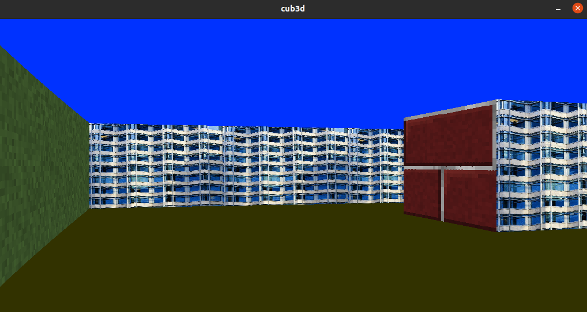

# cub3D
Graphics project in which to create a dynamic view inside a maze.



## Description
This project is inspired by Wolfenstein 3D, one of the first first-person shooter games. I used the raycaster algorithm to draw the walls column per column on the screen. Each direction, North, South, East, West, has a different texture.

You can provide your own map to the _cub3D_ executable. This map should be in a file with a _.cub_ extension called the cub-file. It should contain information about textures, colours and the map itself. You can see examples inside _scenes/correct/_ . If the cub-file contains an error, the program throws an error message.

To check whether the map is completely closed, I used the floodfill algorithm (recursively). Because the map can become very large, I have written a recursion-manager. When a specific amount of frames are put on top of the stack, the recursion-manager resets the stack and continues where it left of. This way I prevent a stack-overflow for very big maps.

## Installation

Just clone this repo:

```sh
git clone https://github.com/hilmi-yilmaz/cub3D.git
```

## Setup for Linux or MacOS

### Step 1
Go to _incl/is_linux.h_:

If you are on Linux: `#define __LINUX__ 1`

If you are on MacOS: `#define __LINUX__ 0`

### Step 2
If you are on Linux run:
```sh
make __LINUX__=1 && ./cub3d scenes/correct/basic.cub
```

If you are on MacOS:
```sh
make && ./cub3d scenes/correct/basic.cub
```

## Play

You can walk around with A, W, S, D keys and rotate your view with the left and right arrow.

## License
[MIT](https://opensource.org/licenses/MIT)

